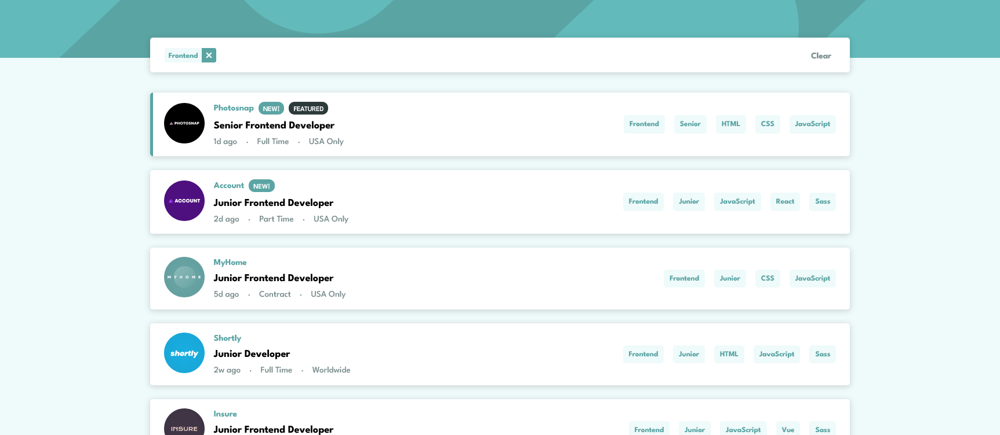
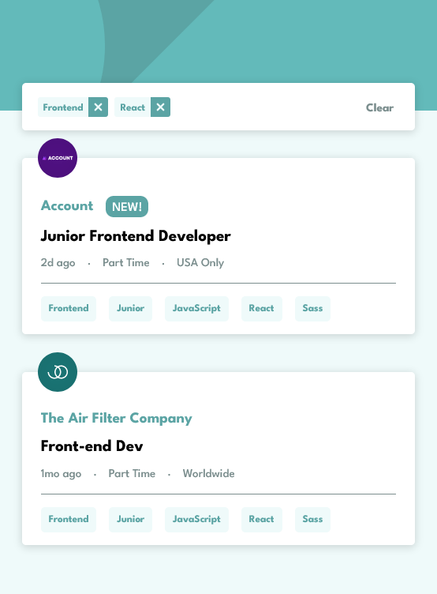

# Frontend Mentor - Job listings with filtering solution

This is a solution to the [Job listings with filtering challenge on Frontend Mentor](https://www.frontendmentor.io/challenges/job-listings-with-filtering-ivstIPCt). Frontend Mentor challenges help you improve your coding skills by building realistic projects. 

## Table of contents

- [Frontend Mentor - Job listings with filtering solution](#frontend-mentor---job-listings-with-filtering-solution)
  - [Table of contents](#table-of-contents)
  - [Overview](#overview)
    - [The challenge](#the-challenge)
    - [Screenshot](#screenshot)
    - [Links](#links)
  - [My process](#my-process)
    - [Built with](#built-with)
    - [Continued development](#continued-development)
    - [Useful resources](#useful-resources)
  - [Author](#author)

## Overview

### The challenge

Users should be able to:

- View the optimal layout for the site depending on their device's screen size
- See hover states for all interactive elements on the page
- Filter job listings based on the categories

### Screenshot

**Desktop**

**Mobile**

### Links

- Solution URL: [https://github.com/evertzner/static-job-listings](https://github.com/evertzner/static-job-listings)
- Live Site URL: [https://gregarious-rabanadas-e5f547.netlify.app/](https://gregarious-rabanadas-e5f547.netlify.app/)

## My process

### Built with

- Semantic HTML5 markup
- CSS custom properties
- SCSS
- Flexbox
- CSS Grid
- [React](https://reactjs.org/) - JS library

### Continued development

I want to get more in deep into React Context.

### Useful resources

- [Zero To Mastery](https://www.udemy.com/course/complete-react-developer-zero-to-mastery/) - Udemy course 'Complete React Developer in 2022 (w/ Redux, Hooks, GraphQL)' from 'Zero to Mastery' 
- [Maximilian Schwarzmüller](https://www.udemy.com/course/react-the-complete-guide-incl-redux/) - Udemy course 'React - The Complete Guide (incl Hooks, React Router, Redux)' from 'Maximilian Schwarzmüller' 
- [Kevin Powell](https://www.youtube.com/kepowob) - Amazing YouTube channel to learn all about CSS.
- [Web Dev Simplified](https://www.youtube.com/c/WebDevSimplified) - Awesome YouTube channel to learn everything about web development.

## Author

- GitHub - [evertzner](https://github.com/evertzner)
- Frontend Mentor - [@evertzner](https://www.frontendmentor.io/profile/evertzner)